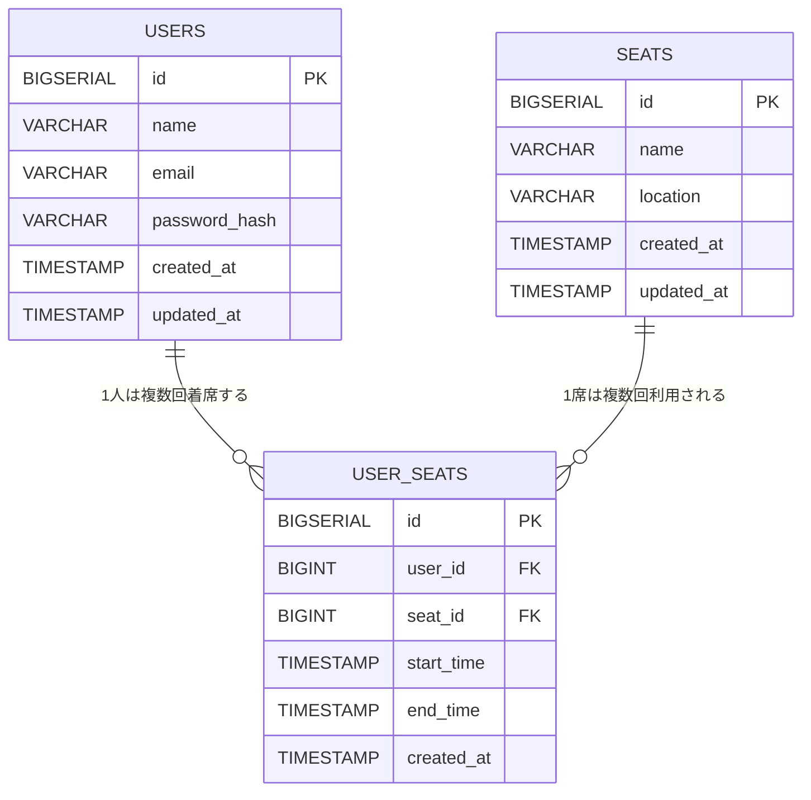

# ER図（Seat Management / OfficeNavi）

本ドキュメントは、席管理アプリケーションで使用する  
データベース構造（ER図）を示します。

---

## ER Diagram

```mermaid
erDiagram
    USERS {
        BIGSERIAL id PK
        VARCHAR name
        VARCHAR email
        VARCHAR password_hash
        TIMESTAMP created_at
        TIMESTAMP updated_at
    }

    SEATS {
        BIGSERIAL id PK
        VARCHAR name
        VARCHAR location
        TIMESTAMP created_at
        TIMESTAMP updated_at
    }

    USER_SEATS {
        BIGSERIAL id PK
        BIGINT user_id FK
        BIGINT seat_id FK
        TIMESTAMP start_time
        TIMESTAMP end_time
        TIMESTAMP created_at
    }

    USERS ||--o{ USER_SEATS : "1人は複数回着席する"
    SEATS ||--o{ USER_SEATS : "1席は複数回利用される"
```
